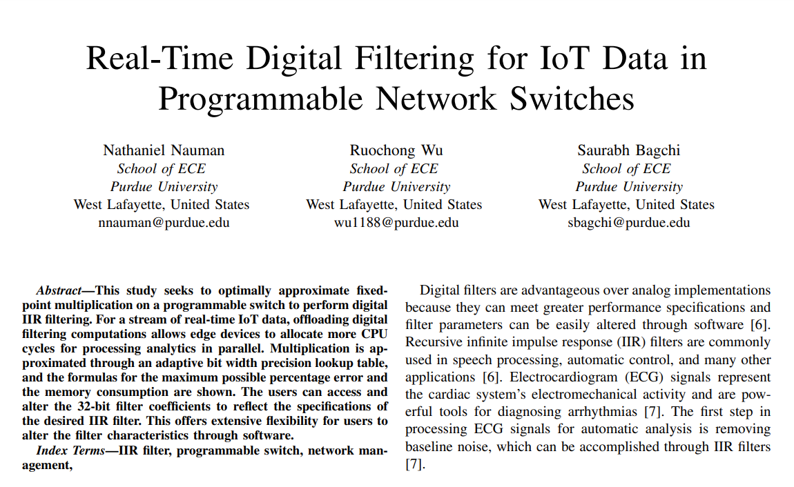
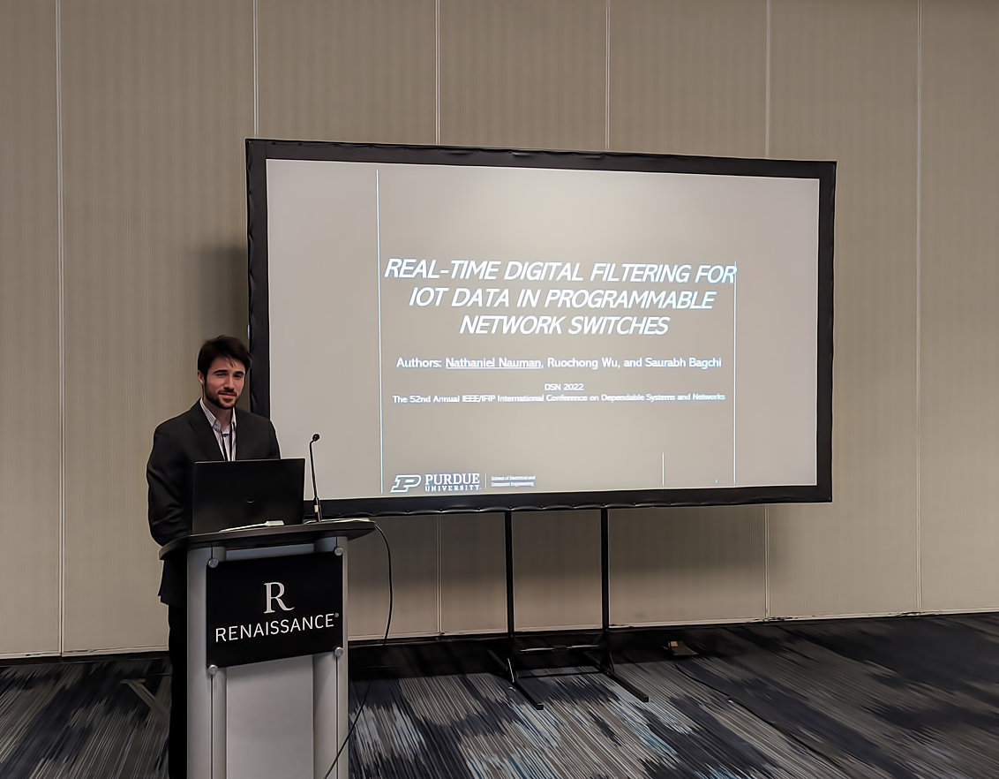

<!-- Main -->

  <!-- One -->
<section id="one">
	

		<header class="major">
			<h1>DSN Conference with Professor Saurabh Bagchi</h1>
		</header>

<!-- Content -->	
I had the honor of being invited to the 52nd Annual IEEE/IFIP International Conference on Dependable Systems and Networks (DSN) in Baltimore, Maryland this summer. This opportunity was particularly exciting since it was my first time presenting at a conference of this scale. During the 2022 spring semester, I took Professor Saurabh Bagchi's graduate-level course "Fault-Tolerant Computer System Design" where I worked with my colleague Ruochong Wu on an extended abstract about offloading analytical computations such as data filtration in Internet of Things (IoT) networks. At the end of the semester, Professor Bagchi awarded Ruochong and I the award for the best project.  

Originally, I was planning to help program triple-core processors for an electric vehicle company in India, but I decided to stay in the US for the summer so that I could attend the DSN conference and continue doing research on campus. The conference was a wonderful way to connect with graduate students from all over the world. In fact, right before my presentation, I had the chance to speak in depth with a Ph.D. student from Poland about his project on tracking human movements for sources of randomness.  
		

		
<b>Figure 1.</b> Title and abstract of the work I presented at DSN.

 My work seeks to optimally approximate fixed-point multiplication on a programmable switch to perform digital IIR filtering. For a stream of real-time IoT data, offloading digital filtering computations allows edge devices to allocate more CPU cycles for processing analytics in parallel. Multiplication is approximated through an adaptive bit width precision lookup table, and the formulas for the maximum possible percentage error and the memory consumption are shown. The users can access and alter the 32-bit filter coefficients to reflect the specifications of the desired IIR filter. This offers extensive flexibility for users to alter the filter characteristics through software.  
		

		
<b>Figure 2.</b> Presenting my extended abstract at the DSN conference in 2022.

