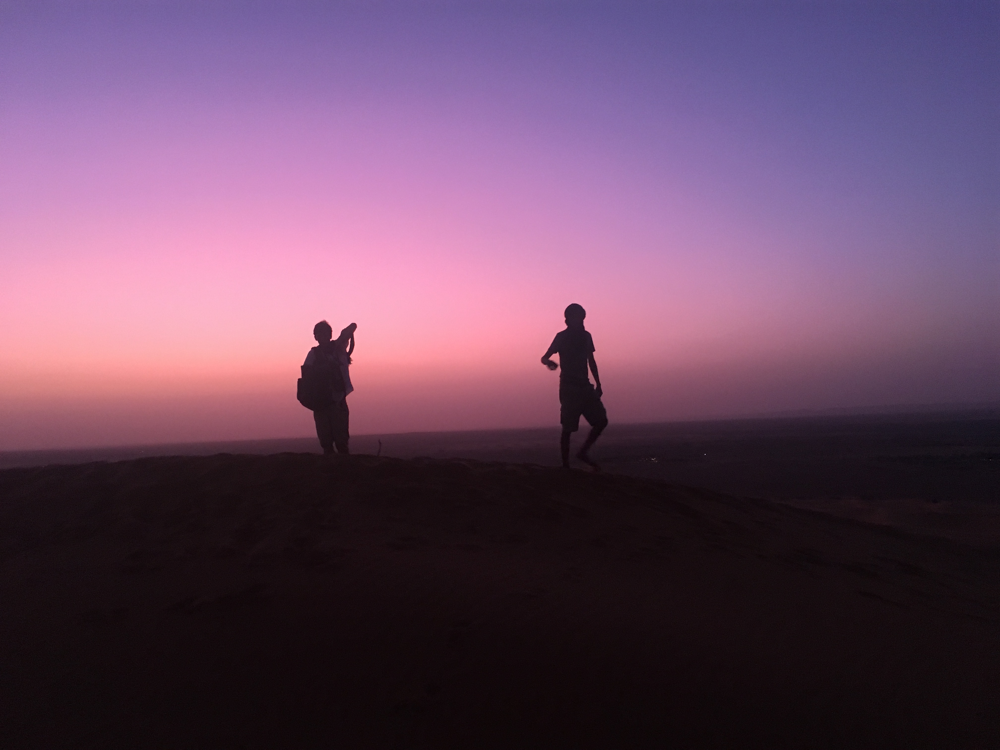

<!-- Main -->

  <!-- One -->
<section id="one">
	

		<header class="major">
			<h1>Personal Interests and Activities</h1>
		</header>

<!-- Content -->
Some of my extracurricular passions include oil painting, mountain climbing, running, and language-learning. I never get tired of studying new languages because it allows me to travel and connect deeply with people from across the world. I am conversational in French, Arabic, and Bengali. The combination of French and Arabic has allowed me to travel around North Africa on multiple occasions: I lived with a host family in Rabat, Morocco for 3 months after graduating high school and I embarked on a week of solo-traveling in Tunisia during the summer of 2022. Bengali is one of the richest languages on the planet since it boasts exceptional poetry and beautiful songs, and I was surprised to find that Bengali is more widely spoken than French. I recently won the State Department's Critical Language Scholarship to study Bengali full-time in Kolkata, India from June to August.  
	
<html>
<head>
<meta name="viewport" content="width=device-width, initial-scale=1">

</head>
<body>

<h2 style="text-align:center">Honors College Study Abroad in Italy (2022)</h2>
	In the summer of 2022, I traveled to Italy to explore its rich history and culture from the medieval period to the postmodern present. Italy is especially unique since all of these cultural and philosophical movements coexist beautifully. A significant amount of medieval, Renaissance, and modern architecture is well-preserved. This intensive study abroad was made possible by Purdue University's Honors College.  
	

  

    
  

  

    
  

  

    
  

	
  

    
  

  <a class="prev" onclick="plusSlides(-1, 1)">&#10094;</a>
  <a class="next" onclick="plusSlides(1, 1)">&#10095;</a>

  
	
<h2 style="text-align:center">Studying Arabic full-time in Rabat, Morocco (2019)</h2>
	In the summer of 2019, I received a full scholarship from the State Department to study Arabic through immersion. I had the privilege of volunteering at two centers in Rabat, Morocco by cooking and serving food. One of these two institutions was a women’s hospital. As I brought fried sweets to each woman’s bed, I listened to their stories, hopes, and hardships. This was one of the most humbling experiences of my life.  

  

    
  

	
  

    
  

	
  

    
  

  

    
  

  

    
  

  <a class="prev" onclick="plusSlides(-1, 0)">&#10094;</a>
  <a class="next" onclick="plusSlides(1, 0)">&#10095;</a>

	

</body>
</html> 
