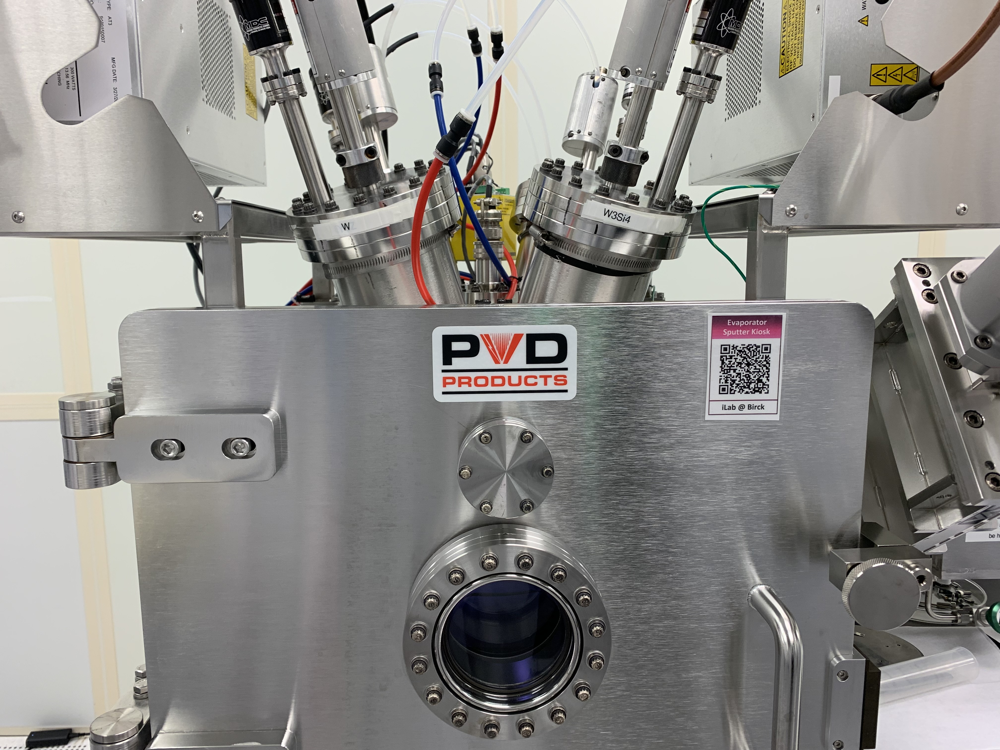

<!-- Main -->

  <!-- One -->
<section id="one">
	

		<header class="major">
			<h1>Nanofabrication in Purdue's Cleanroom</h1>
		</header>

<!-- Content -->
I was the first undergraduate student to take part in Purdue's new IC fabrication course. While fabricating cantilevers, I learned how to operate equipment in Birck Nanotechnology Center's cleanroom including atomic layer deposition (ALD), physical vapor deposition (PVD), photolithography, as well as wet and dry etching. This hands-on laboratory was supplemented by in-class instruction about silicon integrated circuit fabrication techniques. As part of a small team, I developed a hypothetical integration strategy for Intel's upcoming RibbonFET (gate-all-around transistor architecture) with a step-by-step fabrication flow. RibbonFETs are expected to replace finfet nodes in future Intel chips.  

While learning how to operate equipment in Birck Nanotechnology Center, I grew hafnium oxide films on silicon substrates using the Fiji F200 high-vacuum ALD. The photolithography equipment that we used is the Suss MA6 Mask Aligner, or MA6 for short. It is designed for high-resolution micrometer-scale lithography, and we use the iLab system to enable the machine. We start by prebaking and applying photoresist by spin-coating. After exposing the wafer in the aligner, we use developer to dissolve away the photoresist.

		
<b>Figure 1.</b> This direct current PVD equipment uses ionized gas to vaporize (sputter) metals and dielectrics.

