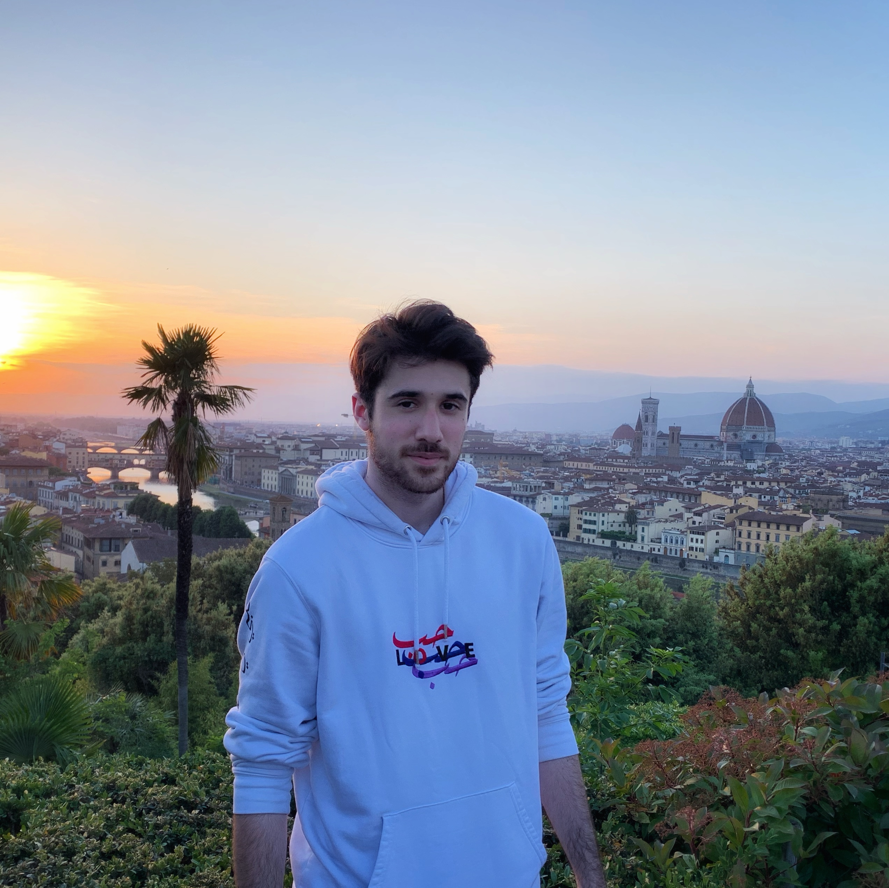

<html>
<head>

<meta name="viewport" content="width=device-width, initial-scale=1">

</head>
<body>

  

    
I was born in New Orleans, the birthplace of jazz. I am currently a master's student in Electrical Engineering at Purdue University. In 2022, I graduated with  my BS Honors in Computer Engineering from Purdue along with minors in Mathematics and Arabic.  
    My research interests are photonics and materials where quantum mechanics gives rise to extraordinary exotic properties through magnetism and topology. I was recently awarded the NSF Graduate Research Fellowship for my proposal on magnetic skyrmions in synthetic antiferromagnets.  
    To download my one-page CV, please click <a id="raw-url" href="https://raw.githubusercontent.com/natenauman/natenauman.github.io/master/CV_Nauman.pdf">here</a>.  
    <b>Master's of Science</b> in Electrical and Computer Engineering (2023), Purdue University 
    <b>Bachelors of Science Honors</b> in Computer Engineering (2022), Purdue University

  

  

     
  

</body>
</html>
