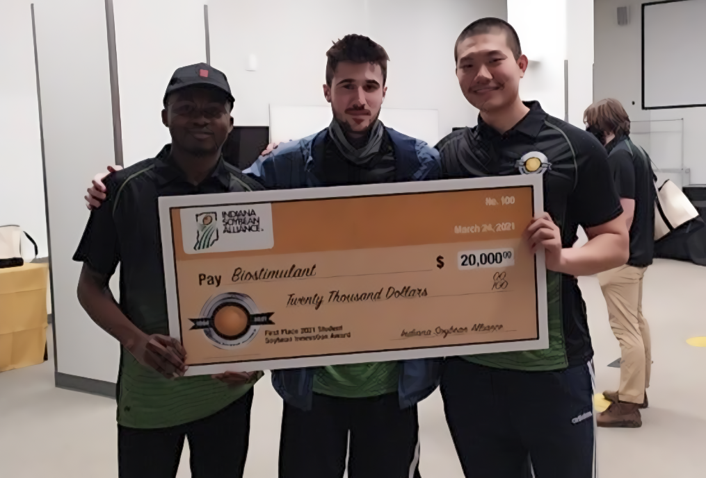
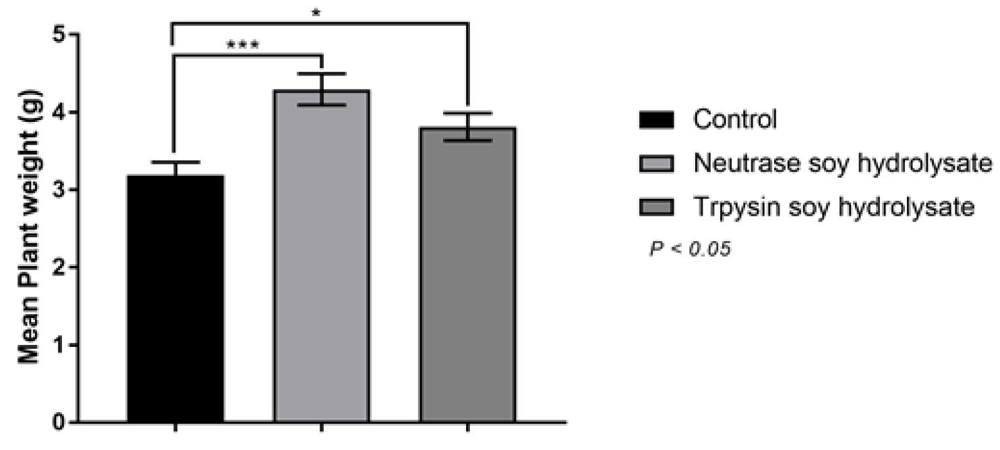
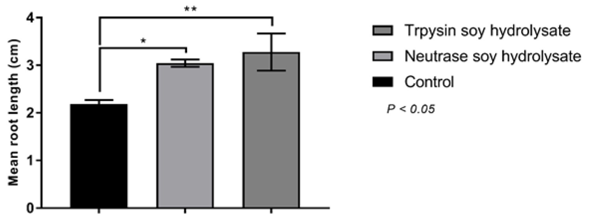

<!-- Main -->

  <!-- One -->
<section id="one">
	

		<header class="major">
			<h1>Professor Michael Ladisch's Laboratory of Renewable Resources Engineering (LORRE)</h1>
		</header>

<!-- Content -->
I led a team comprised of two other students, one from animal sciences and the other from agribusiness, under Distinguished Professor Michael Ladisch to invent and experimentally validate a new soy-based biostimulant. We won an award of $20,000 and gave numerous interviews. In August 2021, I was invited to speak about the environmental benefits of my biostimulant product with Indiana’s Industry Affairs Committee, a panel composed of state senators and industry leaders. This was an opportunity for me to convey my work to people with non-technical backgrounds. While in Professor Ladisch's lab, I also gained experience analyzing proteins with high-performance liquid chromotagraphy equipment.  
		

		
<b>Figure 1.</b> My teammates and I being awarded the first place prize.

 The global crises of food insecurity and environmental damage from agricultural systems may benefit from plant-derived biostimulants. Biostimulants have been shown to augment plant growth and improve effects related to plant health. This study compares the effects on the mean mass and root length of lettuce plants after applying soy protein hydrolysate. Enzymatic hydrolysis is used to obtain two different hydrolysates through the proteases neutrase and trypsin. The resulting soy protein hydrolysates from both enzymes had statistically significant improvements over the control group in both categories. Although neutrase and trypsin perform very different catalyzation processes, there was no significant difference in their effects on yield. Soy protein hydrolysate has excellent potential in promoting plant growth through greater nutrient assimilation, and it may serve as a more scalable alternative to seaweed extract biostimulants.  
		

		
<b>Figure 2.</b> Mean plant weight (g) of lettuce plants with applications of control, hydrolysate from neutrase,
and hydrolysate from trypsin.

		

		
<b>Figure 3.</b> Mean root length (cm) of lettuce plants with applications of control, hydrolysate from neutrase,
and hydrolysate from trypsin.

