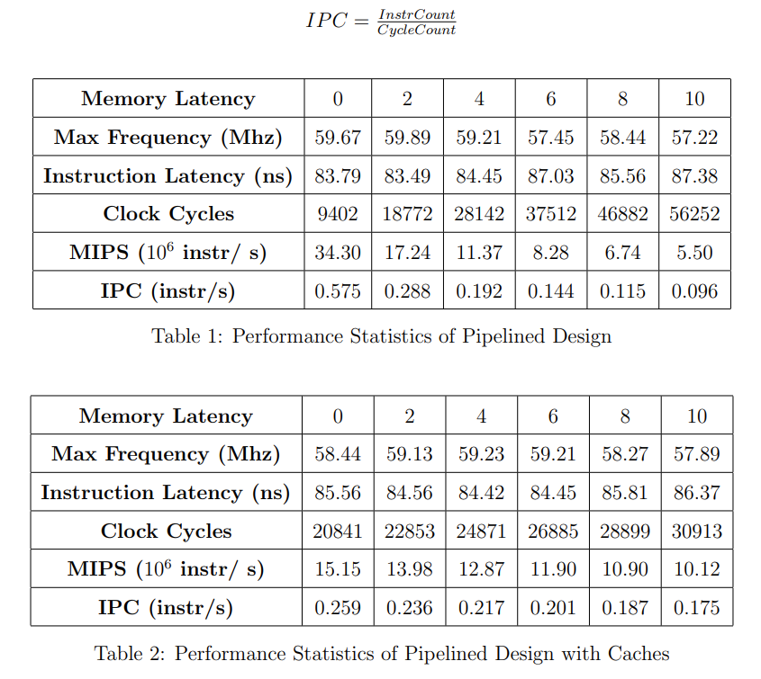

<!-- Main -->

  <!-- One -->
<section id="one">
	

		<header class="major">
			<h1>Multicore Processor on FPGA</h1>
		</header>

<!-- Content -->
Designing and implmenting a pipelined, multicore processor with cache coherency remains one of the most difficult yet rewarding projects of my life. Purdue is the only university in the country that offers a course dedicated to such an extensive FPGA project. Prior to this class, I studied digital design on FPGA boards in undergraduate ASIC design courses for one year. I also wrote dual thread programs in the assembly language MIPS.  
My teammate and I recorded the maximum clock frequency and clock cycle used in gate level simulations and computed both the Instruction Latency (IL) and the number of Millions Instructions Per Second (MIPS) to compare two designs. The benchmark program we used throughout testing is merge sort. This program's instruction count is 5404 in the single thread version of merge sort and 5421 in the dual thread version of merge sort.  

<b>Figure 1.</b> Functional block diagram of the pipelined multicore processor.

		 

		
