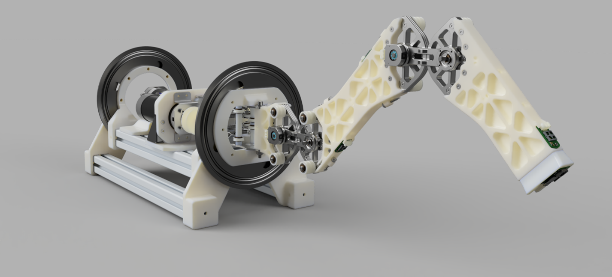
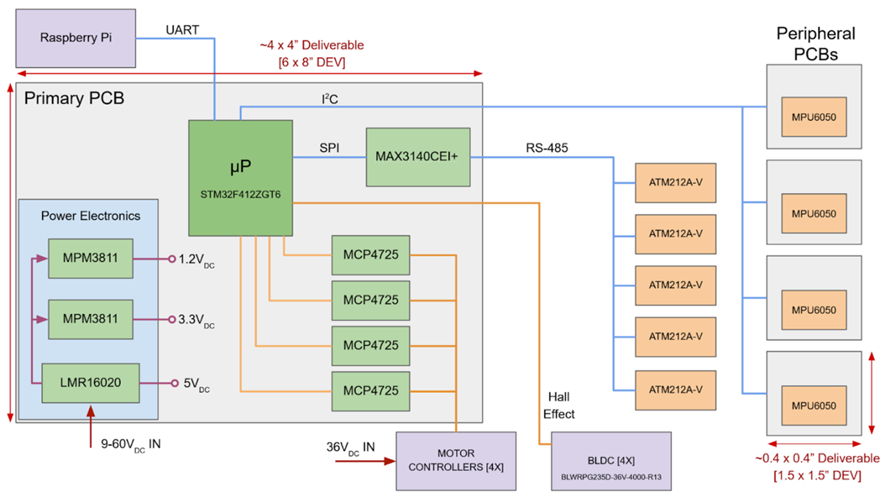

<!-- Main -->

  <!-- One -->
<section id="one">
	

		<header class="major">
			<h1>Advanced Robotic Arm</h1>
		</header>

<!-- Content -->

The robotic arm takes a coordinate provided by the user and determines the optimal combination of angles to move its end-effector as desired. It can also trace and reproduce movements by recording the angles of the revolute joints over time. The mechanical structure boasts augmented stability and force multiplication due to the cabling linkages located at each joint. This design incorporates biomimicry by imitating the flexion-extension system of ligaments through pulleys and tensioned cables. 
Additionally, a Raspberry Pi is used to display a user interface, stream sensor data in real time, locate and identify objects through a camera, and even simulate how the arm is expected to move in 3-dimensional space. We were able to scale the raw gyroscope and acceleration data from the IMU and plot the data points live through the Raspberry Pi. The IMU also has EMI protection, and most of the traces on the PCB have ESD protection to ensure the safety and reliability of the components. Finally, we simulated all mechanical movements in Python before construction by modeling the inverse kinematics algorithm. 
This robotic limb is meant to function as a building block for constructing walking robots. It is specially designed as a hexapod leg for traversing non-planar environments, but its possible applications in industry are endless. The cable driven revolute joint was directly inspired by the LIMS2-AMBIDEX arm which was developed by researchers in South Korea. It contains two counteractings pulley sets which use the same cable reel. They act around pulleys around the joint to enable bending. In this design, augmenting the mechanical advantage is proportional to the number of pulleys and rollers. 

 The primary computational engine is a 32-bit, 144-pin microcontroller (MCU), that will coordinate and manage data acquisition, digital signal processing (DSP), communication, and motor control. Absolute optical encoders mounted on each mechanical joint assembly report the robotic arm position over SPI at any point in time. Inertial measurement units (IMUs), communicating over I2C, allow for measurement of vibration and mechanical deviation from position determined via optical encoders. Due to drift, IMUs must be re-zeroed when the system is stationary between movement sets. 

		
 The pulley-cable system offers a 3:1 mechanical advantage and consequently mitigates the robot's expected power demand. Two 450W parallelized power supplies (SE-450-36) provide sufficient power, while a single 36V, 9.7A supply (LRS-350-36) powers all electrical systems. A 36 to 5V buck converter supplies the primary rail on the PCB, with additional buck and LDO converters supplying a logic voltage of 3.3V to peripheral systems. The STM32F412 microcontroller consumpes about 125 mW of power.
